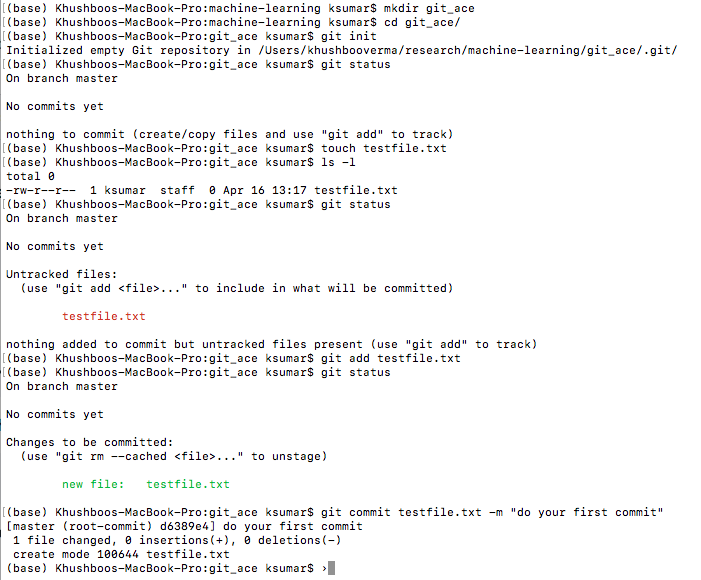

# These instructions assumed that you have some knowledge of bash shell
## Start with your bash shell
**Create a directory**
```
mkdir git_ace
```
**Get in the directory to start building your project**

```
cd git_ace
```

**Initiates a local git repository**

```
git init
git status
```

**Create your first file**
```
touch testfile.txt
```
**Check if this file is there in the directory you are in**

```
ls -l
```
**Check if git know about it**

```
git status
```
you might have noticed that git does not know about it

**adding file to git**
```
git add testfile.txt
git status
```
**Committing file**
```
git commit testfile.txt -m "trying to commit my first file"
```
**Here are the list of above steps you will see on your terminal**
