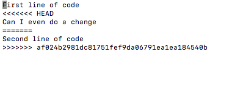
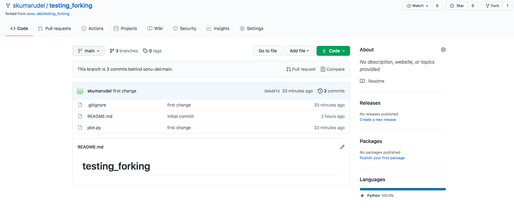
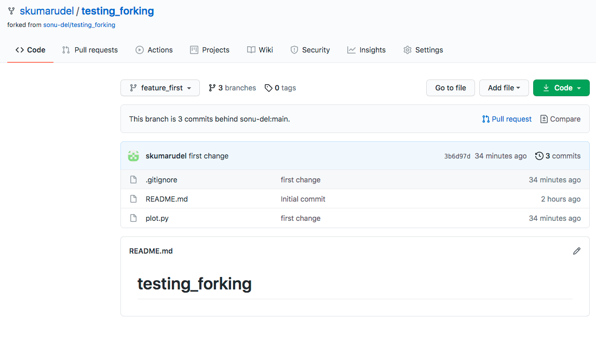
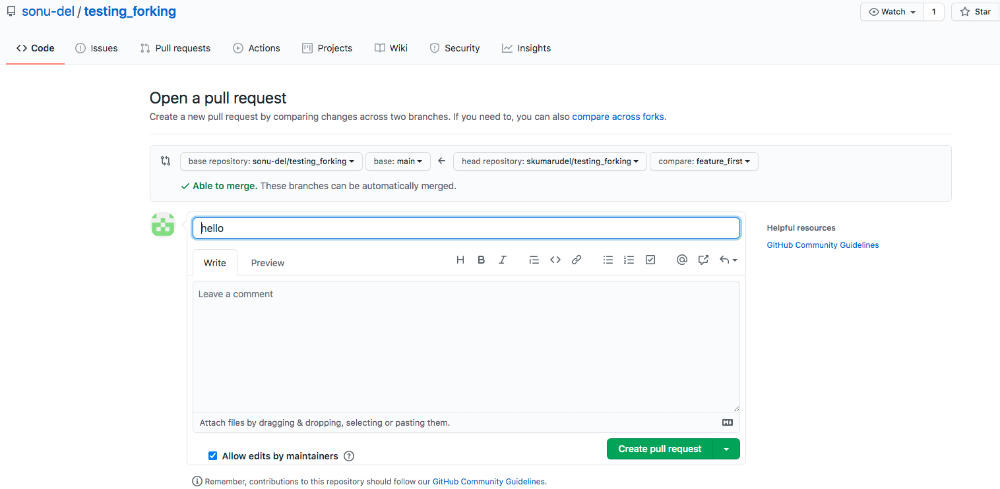
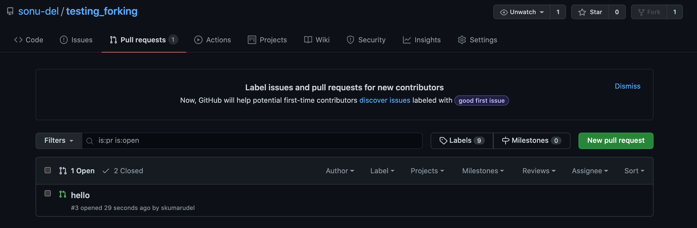
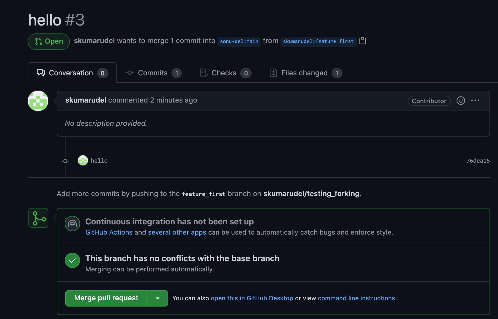

# These instructions assumed that you have some knowledge of bash shell
## Start with your bash shell
**Create a directory**
```
mkdir git_ace
```
**Get in the directory to start building your project**

```
cd git_ace
```

**Initiates a local git repository**

```
git init
git status
```

**Create your first file**
```
touch testfile.txt
```
**Check if this file is there in the directory you are in**

```
ls -l
```
**Check if git know about it**

```
git status
```
you might have noticed that git does not know about it

**adding file to git**
```
git add testfile.txt
git status
```
**Committing file**
```
git commit testfile.txt -m "trying to commit my first file"
```
**Here are the list of above steps you will see on your terminal**


## Go online and create a new repository with the same name as you create locally on your machine (name: git_ace)
**Below are the steps to follow**


 

**The final step is to push your changes or files from local repository to your new remote repository
```
git remote add origin https://github.com/skumarudel/git_ace.git
git remote -v
git push -u origin master
```
**Modify the file and push the changes to remote repository**

```
echo "First line of code" >> testfile.txt
git status
git add testfile.txt
git commit testfile.txt -m "Modify the file"
git push
```
Go online to your repository and see if the changes you made appear or not?

## Merge problem
**Lets say for some reasons you update your file online (see below)**


**Then you go to your local repository and do another modification in the same file**
```
echo "Can I even do a change" >> testfile.txt 
git commit testfile.txt -m "Modify file again"
git push
```
When you do the above steps you should see an error like following
 * To https://github.com/skumarudel/git_ace.git
 * ! [rejected]        master -> master (fetch first)
 * error: failed to push some refs to 'https://github.com/skumarudel/git_ace.git'
 * hint: Updates were rejected because the remote contains work that you do
 * hint: not have locally. This is usually caused by another repository pushing
 * hint: to the same ref. You may want to first integrate the remote changes
 * hint: (e.g., 'git pull ...') before pushing again.
 * hint: See the 'Note about fast-forwards' in 'git push --help' for details. 

**Fixing the above issue**
You need to pull the changes first
```
git pull
```

Edit the file using your favorite editor (I love emacs)
```
emacs testfile.txt
```
Remove the lines in file starting with >>>, <<<, and ==, and then modify the file the way you want it ot look like

 

Now add the file again and commit (Note commit has to be global to do merging)
```
git add testfile.txt
git commit -m "merge conflict solve"
git push
```

## Forking, Branching and pulling
### These concepts are important if you want to collaborate on a exisitng open source git repo

**Forking**
lets say there is open source git repository already existed. You want to add some new features in the repository. Fork is just an independent copy of the orignal repository and by forking and cloning you can change whatever you want to change without affeting the original repository

**Steps:**

* Go to the url of the repository https://github.com/sonu-del/testing_forking
* Click on the fork button in the right corner (see image below)
* Clone the repository locally
```
git clone https://github.com/skumarudel/testing_forking.git
``` 
 
 

### Add a remote
You are not the only one who wants to contribute. There may be 10 more people who are working simultaneously on the same project. Therefore to do changes with the most upto date repository, you need to add pointing to the original repository.

```
git remote add upstream https://github.com/sonu-del/testing_forking.git
```

you can verify now that you have two remotes, **origin** and **upstream**

```
git remote -v
``` 

### Add a new Branch
Now is the time to add some changes to the repository. To do thar, first create a new branch independent of the master branch

```
git checkout -b feature_first
```

Do changes in that branch, commit the changes in local branch and push the changes to your forked repository and check the status of changes.

```
touch plot.py
echo "import matplotlib.pyplot as plt" >> plot.py

git add .
git commit -m "Adding a python library to use"
git push origin feature_first
```

### Pull request
At last, we will ask for a "pull request" where we will request the maintainers of the original repository to have a look at our modifcations. To open a pull request do the following steps:
* Go to your online account and navigate to the branch. Click the main button on left side, a drop down menu will appear. Select the branch you want to merge with original repository.  

 

* Click on the pull request button (blue color in the image below on right side)

 

* Click on the create pull request button in green (lower right)
 


* Once the pull request is created, the mainter will accept your request (of course after looking at your modifications)
 
 
